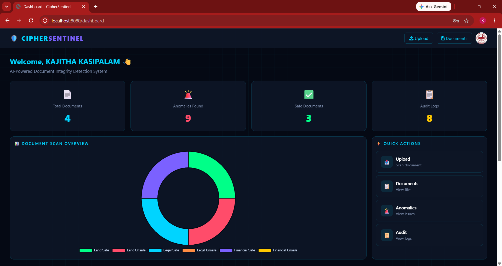
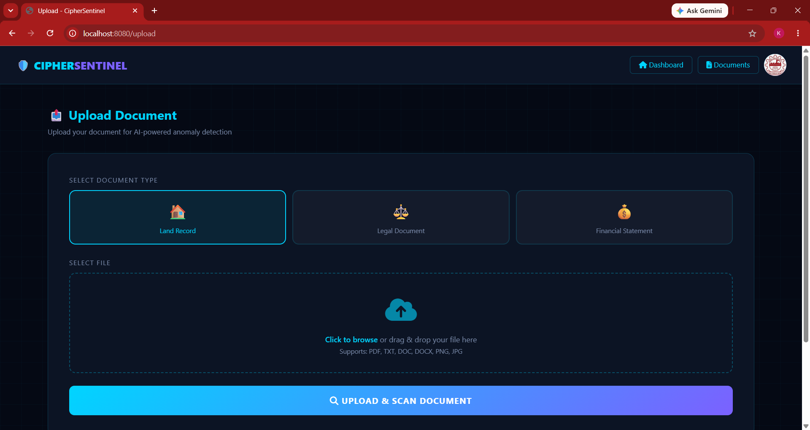
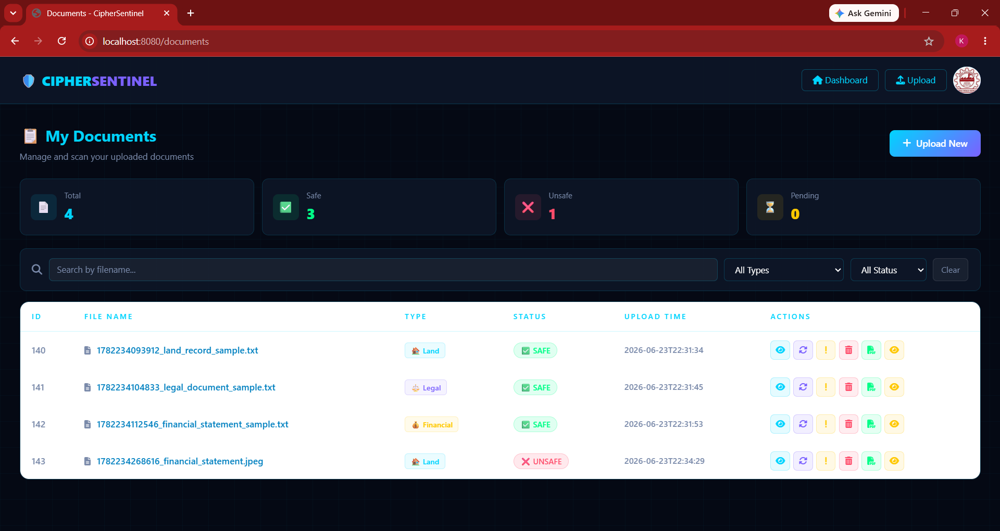
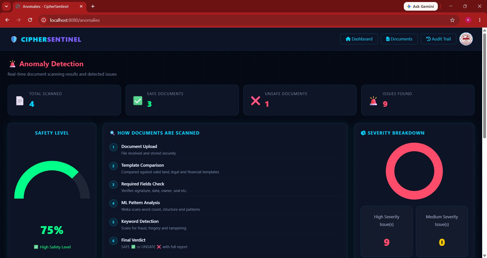
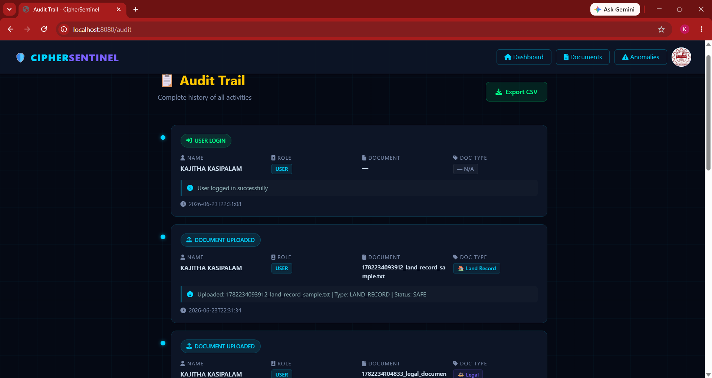
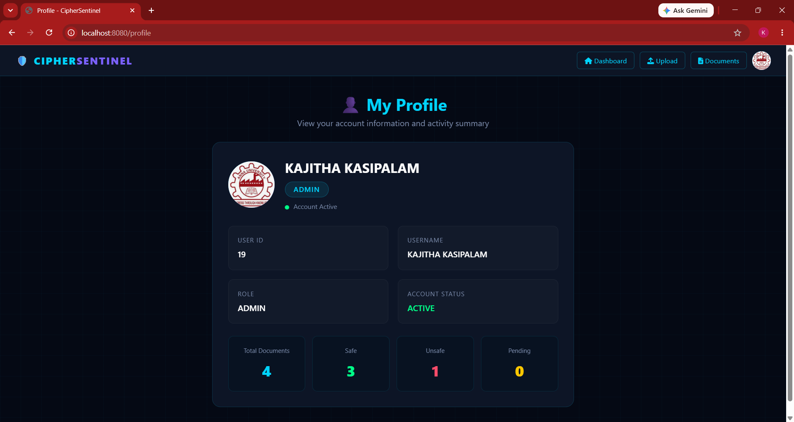
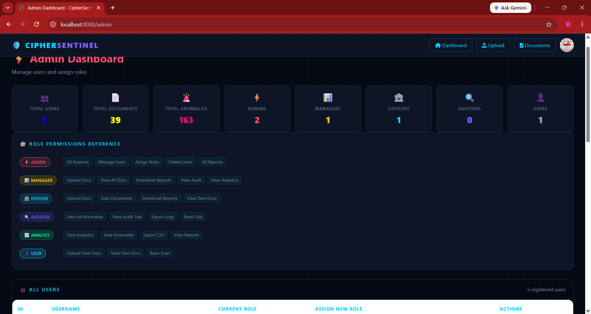

🛡️ CipherSentinel

AI-Powered Document Integrity Detection System

📌 Overview

CipherSentinel is a secure document verification and anomaly detection platform developed to identify document tampering, integrity violations, suspicious modifications, and missing critical information.

The system currently analyzes:

* 🏠 Land Records
* ⚖️ Legal Documents
* 💰 Financial Statements

using OCR, SHA-256 verification, similarity analysis, anomaly detection, audit logging, and automated email notifications.

✨ Key Features

* 📄 Document Upload & Verification
* 🔍 OCR-Based Text Extraction
* 🔐 SHA-256 Integrity Verification
* 📊 Similarity Score Analysis
* 🚨 AI-Assisted Anomaly Detection
* 🛡️ Trust Score Calculation
* 📜 Audit Trail Monitoring
* 📧 Email Alert Notifications
* 👤 User Authentication & Authorization
* 🔑 Role-Based Access Control (User/Admin)
* 👤 Profile Management
* 🔄 Document Re-Scanning
* 📈 Dashboard Analytics
* 🖥️ Admin Dashboard Management

🛠 Technologies Used

Backend

* Java 21
* Spring Boot 3.5
* Spring Security
* Spring Data JPA
* Thymeleaf

Database

* MySQL

AI & Analysis

* Weka
* Apache Tika
* Tesseract OCR

Security

* SHA-256 Hash Verification

Frontend

* HTML
* CSS
* JavaScript
* Bootstrap

📂 Project Structure

CipherSentinel
│
├── src/
│   ├── main/
│   │   ├── java/com/example/demo
│   │   ├── resources/templates
│   │   ├── resources/static
│   │   └── application.properties
│
├── database/
│   └── ciphersentinel_schema.sql
│
├── screenshots/
│
├── pom.xml
├── README.md
└── .gitignore

⚙️ Prerequisites

Install the following before running the project:

* Java JDK 21
* Maven 3.9+
* MySQL Server
* Spring Tool Suite (STS) / Eclipse / IntelliJ IDEA
* Git

🗄️ Database Setup

Create Database

CREATE DATABASE ciphersentinel;

Configure application.properties

spring.datasource.url=jdbc:mysql://localhost:3306/ciphersentinel
spring.datasource.username=root
spring.datasource.password=your_password

spring.jpa.hibernate.ddl-auto=update
spring.jpa.show-sql=true

📧 Email Configuration

spring.mail.host=smtp.gmail.com
spring.mail.port=587
spring.mail.username=your_email@gmail.com
spring.mail.password=your_app_password

spring.mail.properties.mail.smtp.auth=true
spring.mail.properties.mail.smtp.starttls.enable=true

 🔍 Tesseract OCR Setup

Install Tesseract OCR:

https://github.com/UB-Mannheim/tesseract/wiki

Configure Tesseract path in the project:

tesseract.setDatapath("C:/Program Files/Tesseract-OCR/tessdata");

 🚀 Running the Project

Clone Repository

git clone https://github.com/YOUR_USERNAME/CipherSentinel.git

Move into Project

cd CipherSentinel

Build Project

mvn clean install

Run Application

mvn spring-boot:run

Open Browser

http://localhost:8080

 👤 User Roles

* USER
* ADMIN

📄 Supported Document Types

* Land Records
* Legal Documents
* Financial Statements

📸 Project Screenshots

### Dashboard

### Upload Page

### Documents Page

### Anomalies Dashboard

### Audit Trail

### Profile Page

### Admin Dashboard

 🚀 Future Enhancements

* PDF-Based Document Verification
* Image-Based Document Verification
* Image Tampering Detection
* Additional Document Categories
* Advanced AI Detection Models
* Real-Time Monitoring
* Cloud Deployment Support
* Multi-Language OCR Support

👨‍💻 Developer

KAJITHA K

Software Engineer | Web Developer

📧 Email: [kajithak017@gmail.com](mailto:kajithak017@gmail.com)

LinkedIn:

https://www.linkedin.com/in/kajitha-k-729889308

 🛡️ CipherSentinel © 2026

Secure • Intelligent • Transparent
